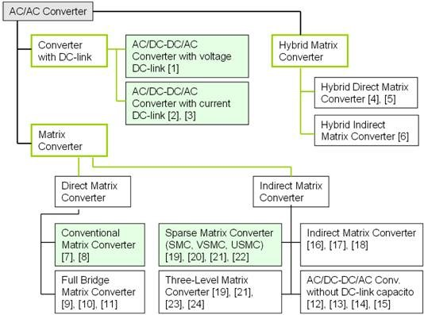
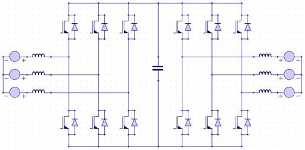
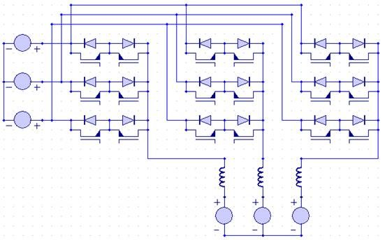
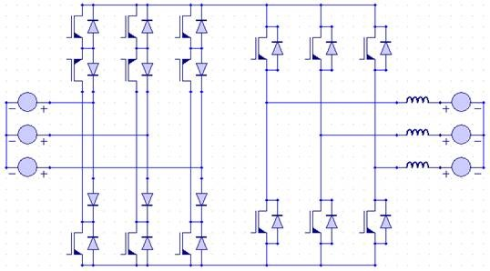
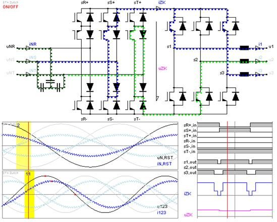
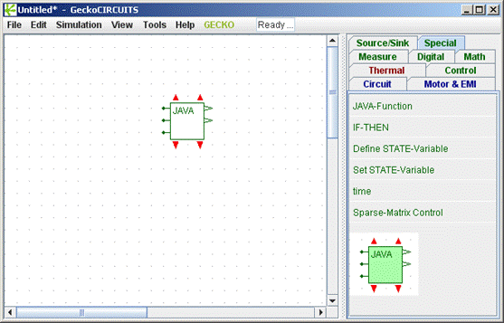
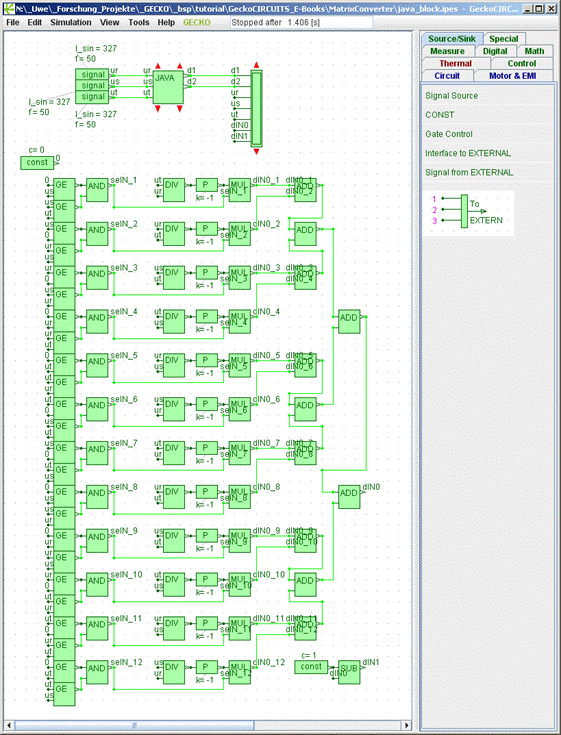
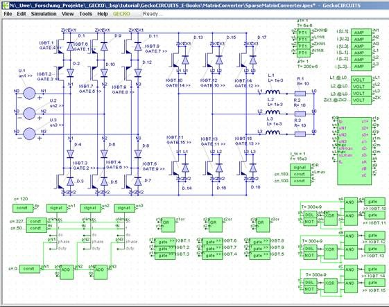
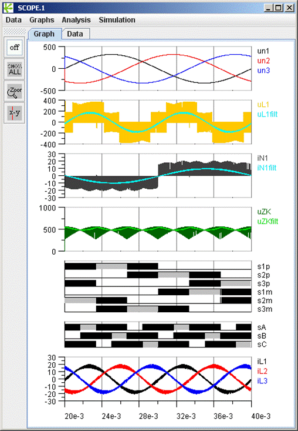

# AC/AC-Conversion for Highly Compact Drives - What Options Do I Have?

## PART I: An Overview of AC/AC-Converter Topologies
 
Dr. Uwe Drofenik Gecko-Research GmbH
ETH Zentrum, ETL H13 CH-8092 Zurich, Switzerland
Email    contact@gecko-research.com
 
June 11, 2009
  
## Overview – Classification of Three-Phase AC/AC Converters
 
For operating a Permanent Magnet Synchronous Machine (PMSM), which allows a highly compact design, you have to supply three-phase voltage with controllable output frequency and controllable voltage amplitude. There are many different alternatives for the AC/AC converter. It is very helpful to look at the systematic classification shown in Fig. 1 which is based on a discussion in [25]. In this report we will have a look at the converters in the green boxes. For details of all converter systems see the references.
 


*Fig. 1: Classification of Three-Phase AC/AC Converters.*
 
## The Classic Solution – AC/AC Conversion Employing a DC-Link
 
In order to control the speed of a Permanent Magnet Synchronous Machine (PMSM) one must be able to control voltage amplitude and frequency of the three-phase voltage system, which connects to the PMSM.
A standard solution for AC/AC conversion with
- Controllable output voltage amplitude
- Controllable output frequency
- Approximately sinusoidal input currents
- Bidirectional power flow
is the coupling of two inverters via a DC-link. The topology employing a capacitor, which gives defined voltage in the DC link, is shown in Fig. 2. The PMSM is modelled by three inductors and three voltage sources connected to nodes A, B, C at the output side.
 


*Fig. 2: Topology of the three-phase AC/AC converter with voltage DC-link.*
 
The input side converter could be alternatively realized as simple diode bridge, but the input current would contain significant low-frequency harmonics then. The diode bridge could not feed back braking energy in to the mains. Therefore, a braking resistor in the DC link would be needed. Alternatively, a thyristor bridge at the input side could feed back braking energy, but would still suffer from significant low-frequency input current harmonics, especially during inverter operation.
Instead of defining a voltage in the DC link, one could also define the current in the DC link via DC link inductor as shown in Fig. 3. The converter system in Fig. 3 needs small capacitive filters at input- and output side for decoupling the inductors.


*Fig. 3: Topology of the three-phase AC/AC converter with current DC-link.*
 
The big advantage of the DC link is the decoupling (at least, to a large extent) of the control tasks of the input-side and the output-side converter.
A disadvantage of such converter systems is the DC-link energy storage element which shows typically a relatively large physical volume. Furthermore, in case an electrolytic capacitor is used in the topology of Fig. 2, this bulky passive component would reduce the system lifetime because its reliability is relatively low in comparison with the other components in the power circuit.
 
## How the Matrix Converter Helps You to Get Rid of Passive Components in the DC-Link
 
Matrix Converters achieve three-phase AC/AC conversion without any intermediate energy storage element. This has the potential to increase power density (output power per converter volume) significantly. Furthermore, omitting the electrolytic capacitor in the DC-link will improve the system reliability.
 


*Fig. 4: Topology of the Conventional Direct Matrix Converter.*
 
The topology of the Conventional Direct Matrix Converter is shown in Fig. 4. The main idea is to be able to connect each input phase directly to each output phase at any time in order to put together a three-phase output voltage system as needed for the variable-speed drive.
 
A disadvantage is the complicated multi-step current commutation scheme where the current control always has to make sure that free wheeling can occur. A large number of states must be considered, and signs of currents and voltages have to be taken into account when defining the switching pattern. A current control error will result in immediate destruction of power switches. Learn more in [26] or visit the free Java-based Matrix Commutation Animation of iPES (Interactive Power Electronics Seminar at www.ipes.ethz.ch/).
 
Matrix Converters are often seen as a future concept for variable speed drives technology, but despite intensive research over the decades they have until now only achieved low industrial penetration. As mentioned before, the reason for this might be the higher complexity in modulation and analysis effort [25].
 
The decision if to select a DC-link topology or a matrix converter is dependent on the switching frequency and on the semiconductor technology. For switching frequencies above 30kHz matrix converters become competitive.
 
## Sparse Matrix Converter – Same Functionality But Reduced Semiconductor Count Plus Safe Commutation
 
The Sparse Matrix Converter is a new kind of AC/AC converter with a reduced number of components and a modulation scheme of low complexity and realization effort. Sparse Matrix Converters avoid the multi-step commutation procedure of the conventional matrix converter which could impair the system reliability for operation in industrial environment.
 
The characteristics of the Sparse Matrix Converter are
 
- Quasi-Direct AC-AC conversion with no DC link energy storage elements
- Sinusoidal input current in phase with mains voltage
- Zero DC link current commutation scheme resulting in lower modulation complexity and very high reliability
- Low complexity of power circuit / power modules available
- Ultra-Sparse Matrix Converter, does show very low realization effort, in case unidirectional power flow can be accepted (admissible displacement of 30° the input current fundamental and input voltage, as well as for the output voltage fundamental and output current), accordingly, a possible application area would be variable speed PSM drives of low dynamics.
 
## Sparse Matrix Converter (SMC)
The Sparse Matrix Converter topology is characterized by 15 Transistors, 18 Diodes, and 7 Isolated Driver Potentials.
 


*Fig. 5: Topology of the Sparse Matrix Converter.*
 
Compared to the Direct Matrix Converter, this topology provides identical functionality, but with a reduced number of power switches and the option of employing an improved zero DC link current commutation scheme, which provides lower control complexity and higher safety and reliability.
 
## Very Sparse Matrix Converter (VSPM)
Characteristics of the Very Sparse Matrix Converter topology are 12 Transistors, 30 Diodes, and 10 Isolated Driver Potentials. It shows identical functionality compared to the Direct Matrix Converter and/or the Sparse Matrix Converter.
Compared to the Sparse Matrix Converter there is a smaller number of transistors, and higher conduction losses due to the increased number of diodes in the conduction paths.
 

 
*Fig. 6: Topology of the Very Sparse Matrix Converter.*

## Ultra Sparse Matrix Converter
 


*Fig. 7: Topology of the Ultra Sparse Matrix Converter.*

The Ultra Sparse Matrix Converter topology has got 9 Transistors, 18 Diodes, and 7 Isolated Driver Potentials.
As mentioned before, the significant limitation of this converter topology as compared to the Sparse Matrix Converter is the restriction of its maximal phase displacement between load-side voltage and input current to ± 30°. The reason is that the input stage of this converter is unidirectional. Possible applications would be PMSM (small phase displacement) with no energy-feedback into the mains.
 
## Finally a Simulation of the Sparse Matrix Converter
Let’s perform a numerical simulation of the operation of the Sparse Matrix Converter (SMC) which is shown in Fig. 5.



*Fig. 8: Java-Animation of the Sparse Matrix Converter at www.ipes.ethz.ch.*
 
We will employ our new simulator GeckoCIRCUITS which gives the following benefits:
- Easy to learn and use
- Very fast and numerically stable
- Multi-domain: Electric - Thermal - EMI
- Easy & fast calculation of transient junction temperatures
- Free online version, no installation required

For the family of the Sparse Matrix Converters, we employ the Zero DC Link Current Commutation which is described in detail in [19]. The scheme makes the commutation safe and simple compared to the conventional multi-step commutation scheme.
One has to define the relevant voltage sector pairs at the input and output side. There are 12 different voltage sectors over one mains period for each side. Fig.8 shows voltage sector 2 for the input side and voltage sector 11 for the output side as yellow shaded areas. The position of the red vertical time slider defines the relevant pair of sectors.
Dependent on the sectors, the power switches have to be switched in certain sequences. This is shown in Fig. 8, bottom diagram, right-hand side. The individual on- and off-times are calculated from equations which are dependent on the relevant sector pair. All information including the equations is given in detail in [19] and/or [21]. All equations are fully implemented in the Java-Applet of Fig. 8. We use the applet to debug simulation and hardware prototypes step by step.
 
Obviously, there waits a lot of hard work to implement a current controller with so many different states to be defined from measured voltages, and such a large number of state-dependent equations and different switching sequences.
 
That’s why we will employ the powerful JAVA-Block of our simulator GeckoCIRCUITS. First let’s study a simple example to understand the JAVA-Block located in GeckoCIRCUITS’ Tab “Special”:
 


*Fig. 9: JAVA-Block in GeckoCIRCUITS.*
 


*Fig. 10: Put the File “tools.jar” Into to Folder jre1.6/lib/ext/ of Your Actual Java Runtime Environment to make the JAVA-Block work.*
 
The JAVA-Block allows to directly write Java-Code which is compiled before begin of the simulation. This Java-Code is then executed within each numerical time step, processing input variables and generating output variables.
 
The JAVA-Block uses the Java-compiler available in Sun’s library “tools.jar” which you have to install in order to make the JAVA-Block work. If “tools.jar” is not yet available on your computer and you double-click the JAVA-Block, you will see a warning dialog which tells you where to get the file “tools.jar” from, and into what folder you should put it. You can download “tools.jar” for free embedded in Sun’s JDK 1.6.
 
In case of problems and/or difficulties please contact contact@gecko-research.com.
 
The JAVA-Block allows in a very simple way the implementation of highly complex functions, and/or creating control blocks one would need but are not included in the control library yet.
 
## How to Use the JAVA-Block
 
In case of the current control of the Sparse Matrix Converter, first one has to identify the actual voltage sectors. Straightforward, this could be implemented in form of if-then statements:
 
``` 
if      ((us<=0)&&(ut<=us)) seIN= 1; 
else if ((us>=0)&&(ur>=us)) seIN= 2; 
else if ((ur>=0)&&(us>=ur)) seIN= 3;
else if ((ur<=0)&&(ut<=ur)) seIN= 4;
else if ((ut<=0)&&(ur<=ut)) seIN= 5;
else if ((ut>=0)&&(us>=ut)) seIN= 6;
else if ((us>=0)&&(ut>=us)) seIN= 7;
else if ((us<=0)&&(ur<=us)) seIN= 8;
else if ((ur<=0)&&(us<=ur)) seIN= 9;
else if ((ur>=0)&&(ut>=ur)) seIN=10;
else if ((ut>=0)&&(ur>=ut)) seIN=11;
else if ((ut<=0)&&(us<=ut)) seIN=12;
```
 
`seIN` is the number of the input voltage sector (e.g. `seIN=2` in Fig. 8). ur, us, ut are the three-phase input voltages of the converter. Now, relative on-times `dIN[0]` and `dIN[1]` of input-side switches can be calculated depending on the sector:

```
switch (seIN) {
    case  1: dIN[0]= -ut/ur;  break;
    case  2: dIN[0]= -ur/ut;  break;
    case  3: dIN[0]= -us/ut;  break;
    case  4: dIN[0]= -ut/us;  break;
    case  5: dIN[0]= -ur/us;  break;
    case  6: dIN[0]= -us/ur;  break;
    case  7: dIN[0]= -ut/ur;  break;
    case  8: dIN[0]= -ur/ut;  break;
    case  9: dIN[0]= -us/ut;  break;
    case 10: dIN[0]= -ut/us;  break;
    case 11: dIN[0]= -ur/us;  break;
    case 12: dIN[0]= -us/ur;  break;
    default: break;
}
dIN[1]= 1 - dIN[0];
```

After this, switching sequences have to be defined based on seIN, and with the relative on-times exact switching sequences can be calculated (it’s a lot of code, not shown here). For the switching pattern of the output stage similar expressions occur. See [19] and [21] for details and algorithms.
 
Now, implementing if-then and switch-statements like above in a circuit simulator is very inconvenient. Fig. 11 shows the control structure necessary to implement the two code blocks above in comparison to the JAVA-Block implementation that does the same job.
 
And that’s just 10% of the whole code of the current controller! 
 
Download the file of Fig. 11 (“java_block.ipes” from package ‘Example Package Matrix’, see end of report), double-click the JAVA-Block, and have a look at the simple code implementation.
 


*Fig. 11: Significant Simplification of Implementation of Control Statements by Using the JAVA-Block.*
 
We put all current control code as described in [19] into a special control block called “Sparse-Matrix Control” (green Tab ‘Special’) which allows to conveniently control the Sparse Matrix Converter, the Very Sparse Matrix Converter and the Ultra Sparse Matrix Converter. The implementation of the Sparse Matrix Converter is shown in Fig. 12.
 


*Fig. 12: Full Implementation of the Sparse Matrix Converter with Zero DC-Link Current Control Scheme in GeckoCIRCUITS.*
 
Download the file of Fig. 12 (“SparseMatrixConverter.ipes” from package ‘Example Package Matrix’, see end of report) and run simulations. The values of uNmax (mains voltage amplitude) and fN (mains frequency) define the input side. The values of uLmax (load-side voltage amplitude) and fL (load-side frequency) define the output side. The switching frequency is given by fDR which is set to 15kHz in this example.
 
Part II will go into the details of the Sparse Matrix Converter model of Fig. 12.
 

 
*Fig. 13: Numerical Simulation of the Time Behavior of the Sparse Matrix.*

## Further Information
 
The topologies discussed here are available for free: 
- Sparse Matrix Converter (Fig. 12): SparseMatrixConverter.ipes
- Very Sparse Matrix Converter (Fig. 6): VerySparseMatrixConverter.ipes
- Ultra Sparse Matrix Converter (Fig. 7): UltraSparseMatrixConverter.ipes 
 
## References

[1] I. Takahashi, Y. Itoh, “Electrolytic Capacitor-Less PWM Inverter“, in Proceedings of the IPEC’90, Tokyo, Japan, , pp. 131 – 138, April 2 – 6, 1990.

[2] K. Kuusela, M. Salo, H. Tuusa, “A Current Source PWM Converter Fed Permanent Magnet Synchronous Motor Drive with Adjustable DC-Link Current“, in Proceedings of the NORPIE’2000, Aalborg, Denmark, pp. 54 – 58, June 15 – 16, 2000.

[3] M. H. Bierhoff, F. W. Fuchs, “Pulse Width Modulation for Current Source Converters – A Detailed Concept,“ in Proceedings of the 32nd IEEE IECON’06, Paris, France, Nov. 7–10, 2006.

[4] R. W. Erickson, O. A. Al-Naseem, “A New Family of Matrix Converters“, in Proceedings of the 27th IEEE IECON’01, Denver, USA, Vol. 2, pp. 1515 – 1520, Nov. 29 – Dec. 2, 2001.

[5] C. Klumpner, C. I. Pitic, “Hybrid Matrix Converter Topologies: An Exploration of Benefits,“ in Proceedings of the 39th IEEE PESC’08, Rhodos, Greece, pp. 2 – 8, June 15 – 19, 2008.

[6] C. Klumpner, “Hybrid Direct Power Converters with Increased/Higher than Unity Voltage Transfer Ratio and Improved Robustness against Voltage Supply Disturbances“, in Proceedings of the 36th IEEE PESC’05, Recife, Brazil, pp. 2383 – 2389, June 12 – 16, 2005.

[7] L. Gyugyi, B. R. Pelly, “Static Power Frequency Changers - Theory, Performance, & Application“, New York: J. Wiley, 1976.

[8] W. I. Popow, “Der zwangskommutierte Direktumrichter mit sinusförmiger Ausgangsspannung,“ Elektrie 28, No. 4, pp. 194 – 196, 1974.

[9] K. K. Mohapatra, N. Mohan, “Open-End Winding Induction Motor Driven with Matrix Converter for Common-Mode Elimination“, in Proceedings of the PEDES’06, New Delhi, India, Dec. 12 – 15, 2006.

[10] M. Braun, K. Hasse, “A Direct Frequency Changer with Control of Input Reactive Power“, in Proceedings of the 3rd IFAC Symposium, Lausanne, Switzerland, pp. 187–194, 1983.

[11] D. H. Shin, G. H. Cho, S. B. Park, “Improved PWM Method of Forced Commutated Cycloconverters“, in Proceedings of the IEE, Vol. 136, Part B, No. 3, pp. 121 – 126, 1989.

[12] P. D. Ziogas, Y. Kang, V. R. Stefanovic, “Rectifier-Inverter Frequency Changers with Suppressed DC Link Components“, IEEE Transactions Industry Applications, Vol. IA-22, No. 6, pp. 1027 – 1036, 1986.

[13] S. Kim, S. K. Sul, T. A. Lipo, “AC/AC Power Conversion Based on Matrix Converter Topology with Unidirectional Switches“, IEEE Transactions Industry Applications, Vol. 36, No. 1, pp. 139 – 145, 2000.

[14] K. Göpfrich, C. Rebbereh, L. Sack, “Fundamental Frequency Front End Converter (F3E)“, in Proceedings of the PCIM’03, Nuremberg, Germany, pp. 59 – 64, May 20 – 22, 2003.

[15] B. Piepenbreier, L. Sack, “Regenerative Drive Converter with Line Frequency Switched Rectifier and Without DC Link Components“, in Proceedings of the 35th IEEE PESC’04, Aachen, Germany, pp. 3917 – 3923, June 20 – 25, 2004.

[16] J. Holtz, U. Boelkens, “Direct Frequency Converter with Sinusoidal Line Currents for Speed-Variable AC Motors“, IEEE Transactions Industry Electronics, Vol. 36, No. 4, pp. 475–479, 1989.

[17] K. Shinohara, Y. Minari, T. Irisa, “Analysis and Fundamental Characteristics of Induction Motor Driven by Voltage Source Inverter without DC Link Components (in Japanese)“, IEEJ Transactions, Vol. 109-D, No. 9, pp. 637 – 644, 1989.

[18] L. Wei, T. A. Lipo, “A Novel Matrix Converter Topology with Simple Commutation“, in Proceedings of the 36th IEEE IAS’01, Chicago, USA, vol. 3, pp. 1749 – 1754, Sept. 30 – Oct. 4, 2001.

[19] J. W. Kolar, M. Baumann, F. Stögerer, F. Schafmeister, H. Ertl, “Novel Three-Phase AC-DC-AC Sparse Matrix Converter, Part I - Derivation, Basic Principle of Operation, Space Vector Modulation, Dimensioning, Part II - Experimental Analysis of the Very Sparse Matrix Converter“, in Proceedings of the 17th IEEE APEC’02, Dallas, USA, Vol. 2, pp. 777 – 791, March 10 – 14, 2002.

[20] L. Wei, T. A. Lipo, H. Chan, “Matrix Converter Topologies with Reduced Number of Switches“, in Proceedings of the VPEC’02, Blacksburg, USA, pp. 125 – 130, April 14 – 18, 2002.

[21] F. Schafmeister, “Sparse und Indirekte Matrix Konverter“, PhD thesis No. 17428, ETH Zürich, Switzerland, 2007.

[22] J. W. Kolar, F. Schafmeister, S. D. Round, and H. Ertl, “Novel Three-Phase AC-AC Sparse Matrix Converters“, Transactions Power Electronics, Vol. 22, No. 5, pp. 1649 – 1661, 2007.

[23] M. Y. Lee, P. Wheeler, C. Klumpner, “A New Modulation Method for the Three-Level-Output-Stage Matrix Converter“, in Proceedings of the 4th PCC’07, Nagoya, Japan, April 2 – 5, 2007.

[24] C. Klumpner, M. Lee, P. Wheeler, “A New Three-Level Sparse Indirect Matrix Converter“, in Proceedings of the IEEE IECON’06, pp. 1902– 1907, 2006.

[25] J. W. Kolar, T. Friedli, F. Krismer, S. D. Round, “The Essence of Three-Phase AC/AC Converter Systems”, Proceedings of the 13th Power Electronics and Motion Control Conference (EPE-PEMC'08), Poznan, Poland, pp. 27 – 42, Sept. 1 - 3, 2008.

[26] P. Wheeler, J. Rodriguez, J. Clare, L. Empringham, A. Weinstein, “Matrix converters: A technology review”, IEEE Transactions on Industrial Electronics, Vol. 49, No. 2, pp. 276–288, Apr. 2002.
