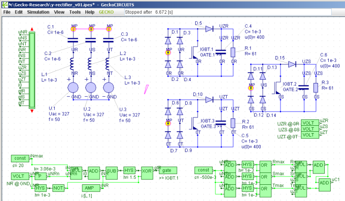

# Aug. 26, 2009 - Debugging a Complex Converter Topology

With converter models of high complexity it is always very important to be able to reliably check where all connections are and if components are really connected.
I have been working with all kind of circuit simulators over the last 20 years. Some simulators allowed to connect component nodes via labels (node names) instead of drawing a connection. I always liked to use this feature.
With increasing complexity this allows you to keep the model drawing 'clean' ... not too many lines. You can connect nodes this way in GeckoCIRCUITS. On the other hand, it's a problem when you can't identify all connections easily because of the missing lines.
With GeckoCIRCUITS we tried a compromise: Activating 'Check Connections' in menu 'Tools' allows you to click on nodes or connections, and highlight the whole connected area.
Have a look at the screenshot below to see what I am talking about. Or visit [GeckoCIRCUITS](http://www.gecko-research.com/applet-mode/geckocircuits_demo.html) to test this new debugging tool directly online.
What else is new?
With the latest version of GeckoCIRCUITS we improved
- Copying of component groups and converters
- Copying component groups from one simulator window into another one via clipboard (this does not work online because of Java security restrictions). Use Import/Export in menu 'Edit'
 
## Screenshots (Y-Rectifier)
Below you see a simulation of a Y-Rectifier. It provides sinusoidal input currents, controlled output voltage and a modular structure. If you are interested in the simulation and/or literature please contact us.

You can draw the connection and click onto it. All connections on the same potential are highlighted in magenta, and all connected nodes are marked by a yellow circle.

If you decide alternatively to omit lines and provide the connection between nodes by equal node labels ('MP' in the example shown), connected nodes are clearly visible. See also how nodes UR, US and UT are connected via labels.

Simulation file 