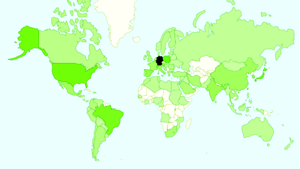

# July 31, 2009 - How do you teach power electronics?

Maybe you have to teach colleagues or customers how power electronics works, maybe you supervise students or make your money as electronics consultant. Or you need to remember how a certain topology works. Based on our own experience we developed years ago the free online-course iPES at www.ipes.ethz.ch which is based on interactive Java Applets.
Probably you have already visited iPES and maybe you are using it from time to time (it's currently available in 12 different languages and has 10,000 visits per month).
Many users pointed out that they would like to have real parameter values in iPES-animations and also more flexibility to change examples.
Therefore, we now integrated GeckoCIRCUITS into iPES. It is a limited version of GeckoCIRCUITS, but it comes with the following features:
- It's free
- Full simulation speed
- No installation - GeckoCIRCUITS runs with the web-browser's Java
- New GeckoCIRCUITS-example collection related to iPES
Have a look at it at the English version, then just follow one of the blue links 'Simulate Online'. Let us know if you like it or what you would improve!
The figure shows the global distribution of iPES-visitors based on 10,000 visitors per month from more than 100 countries. Currently 30% of the visitors are from Germany (1st), 5% are from Japan (2nd).

